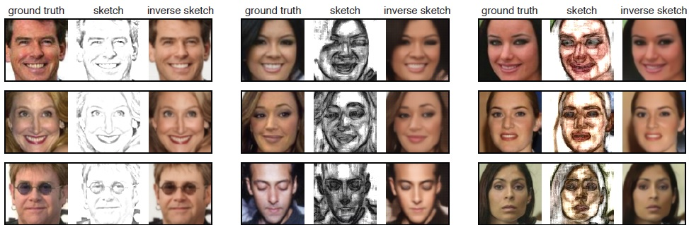
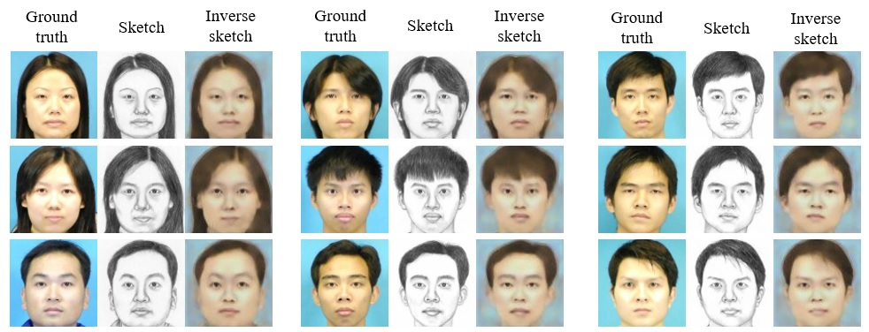

# sketch inversion mxnet

MXNet implementation of [Convolutional Sketch Inversion](https://arxiv.org/abs/1606.03073) 
that use deep neural networks for inverting face sketches to synthesize photorealistic face images. 

Here are some results generated by the authors of paper:



## Setup

### Prerequisites
- Python 2.7
- [MXNet](http://mxnet.io/get_started/setup.html)
- scikit-image
- matplotlib
- regex

### Getting Started
- Clone this repo:
```bash
git clone --recursive https://github.com/VinniaKemala/sketch-inversion.git
cd sketch-inversion
```
- Download the VGG-16 pretrained model and extract the tar file:
```bash
wget http://data.dmlc.ml/mxnet/models/imagenet/vgg/vgg16.tar.gz
```
then put the ```vgg16-0000.params``` on ```pretrained``` folder

- Download and unzip the dataset:

**Note**: The model was only trained using augmented [CUHK dataset](http://mmlab.ie.cuhk.edu.hk/archive/facesketch.html),
which differs from original paper. The original paper used four datasets: [CelebA dataset](http://mmlab.ie.cuhk.edu.hk/projects/CelebA.html), 
[LFW dataset](http://vis-www.cs.umass.edu/lfw/), [CUFS dataset](http://mmlab.ie.cuhk.edu.hk/archive/facesketch.html), and sketches of famous Dutch artists.
For each image in the CelebA and LFW datasets was automatically transformed to a line sketch, a grayscale sketch and a color sketch.

Augmented CUHK dataset:
```
https://drive.google.com/file/d/0B08-z6c0wKDQWlNUMXZfa2ZGNnM/view?usp=sharing
```
It contains 17,108 hand-drawn sketches and their corresponding photographs
with 70% is used for training (11,975 images) and 30% is used for testing (5,133 images).

- Train the model:
```bash
python train.py
```
use ```-h``` to see more options. It uses GPU by default. If you want to run it on CPU, run ```python code/train.py --gpu -1```

- Test the model:
```bash
python test.py
```

## Results
Here is the results generated from this implementation:

- CUHK dataset:

  

## Train
The performance of model can definitely be improved by using larger dataset. 

The model was only trained on 11,975 sketches and their corresponding photos.
To reproduce results presented above, it takes 265 epochs of training. 
Exact computing time depends on own hardware conditions.

You can view the loss training curve by running:
```bash
python log/training_curves.py
```

## Test
Test the model on validation set of augmented [CUHK dataset](http://mmlab.ie.cuhk.edu.hk/archive/facesketch.html) 
It will generate synthesized images provided corresponding labels under directory `output/test`.

## Acknowledgments
Code borrows heavily from [End to End Neural Art with Generative Models](http://dmlc.ml/mxnet/2016/06/20/end-to-end-neural-style.html). 
Thanks for his excellent work!
